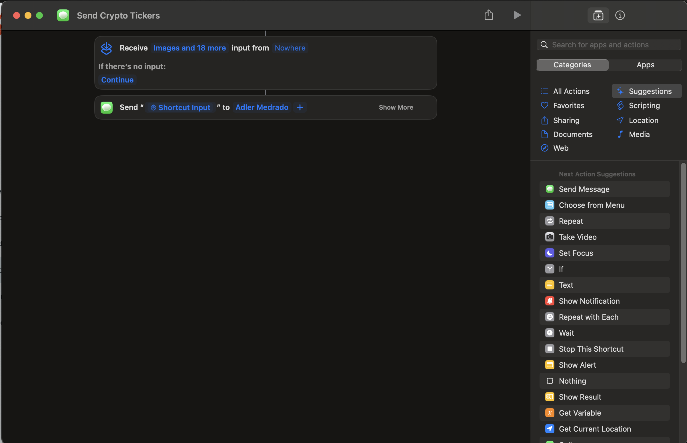

## Fetch Crypto Tickers from Mercado Bitcoin's API and send as message with Apple Messages App.


# Prerequesites

* [Bash](https://www.gnu.org/software/bash/)
* [jq](https://jqlang.github.io/jq/)

# Syntax:
```
./fetch_ticker_and_send_message.sh CRYPTO_TICKERS PHONE_NUMBER
```

# Example of Usage:

```
./fetch_ticker_and_send_message.sh BTC-BRL,ETH-BRL 11999999999
```

You can pass any pair separated by colons, as the example above.

All supported pais: https://api.mercadobitcoin.net/api/v4/symbols (It is a JSON response)

# Integration with Messages App

If the phone number were not an iMessage enabled number, Apple Messages will try to send it by SMS.
The applescript included in this repository is ready to send the message, but can use an Apple Shortcut, also, but you will need to
manually create the shortcut and change (uncomment code) the bash script to call it.

Creating the shortcute is easy, anyway. Just like the screenshot below.


